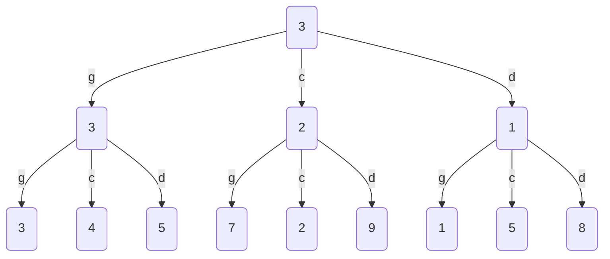
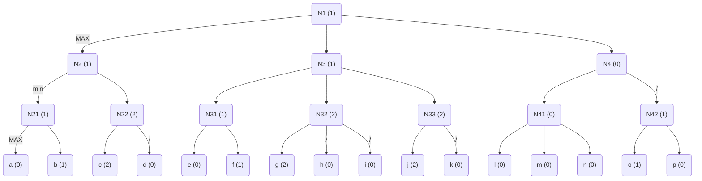
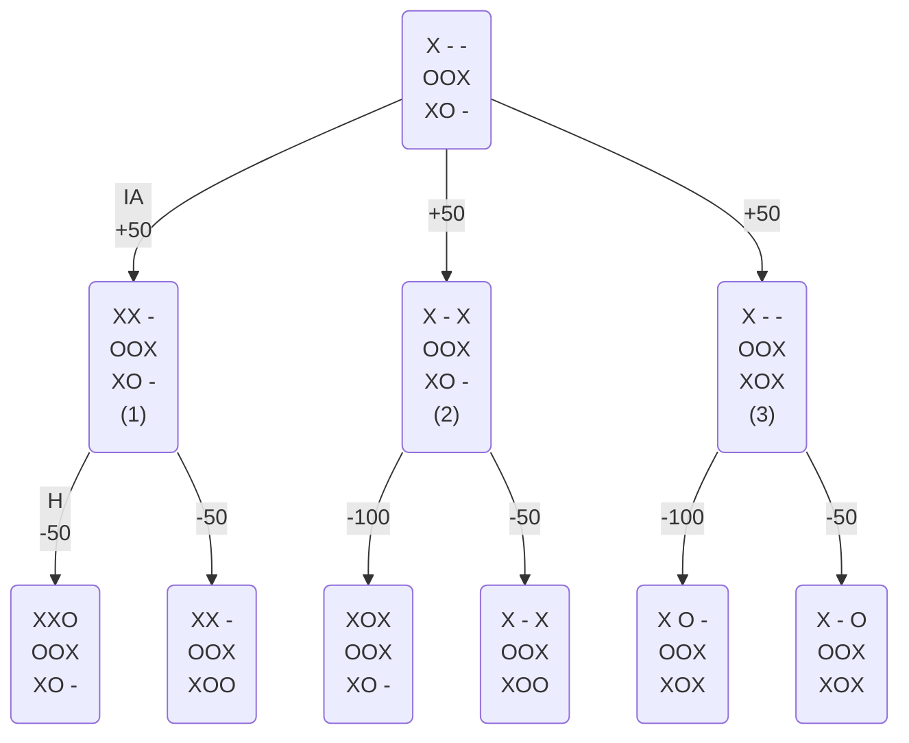

> Généré depuis [StackEdit](https://stackedit.io/). Si ce fichier est sur GitHub, vous êtes en train de lire un backup du document original, qui est accessible [ici](https://frama.link/aden-iutsd) (avec de belles formules à la place des entrées Latex).
>
> Une authentification est demandée. 
> > Compte lecture seule :
> > Identifiant : **reader**
> > Mot de passe : **reader**

# Cours

## MinMax

⇒ Génération d'un arbre des possibilités, puis choix de la possibilité la plus intéressante (contexte : TicTacToe, Go...).

On assigne à chaque coup une valeur et on cherche la valeur la plus intéressante dans le cas d'un coup du programme et la moins intéressante dans le cas d'un coup de l'adversaire.

Lorsqu'il n'est pas possible d'estimer toutes les configurations de jeu, l'attribution des valeurs se fait selon des heuristiques établies par la connaissance du jeu.

## AlphaBeta

Si la valeur d'un fils Max est supérieure à la valeur courante d'un noeud Min, alors les frères du fils n'ont pas besoin d'être explorés.

## Programmation Dynamique

À partir d'une méthode diviser-pour-régner, on résout les sous-problèmes et on stocke les résultats dans une table.
⇒ Utile pour des problèmes d'optimisation (maximisation, minimisation...).

> On dispose d'un sac de monnaie. On veut diviser le sac en deux sacs plus petits de sorte à ce que les sommes contenues dans chacun des sacs est la plus proche possible.
>> On étudie les pièces une à une en évaluant leurs combinaisons avec les pièces déjà étudiées de sorte à dégager les meilleures sommes.
>>
>> |  | 0 | 1 | ... | S/2 -1 | S/2
>> |--|---|---|---|---------|----------
>> |P1| X | | ...| |
>> |P2 = 1| X | X |... | |
>> | P3 = S/2-1 | X | X|... |X |X

# TD

## Exercice 1

Meilleure action possible pour l'IA : g-g.

## Exercice 2

## Exercice 3

Meilleure action de l'IA : (1)

