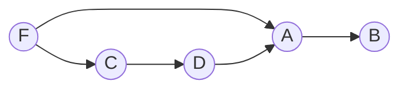

# Cours

## Normalisation

### Rappels

#### Première forme normale

> Une relation R est dite en première forme normale ssi tous ses attributs sont atomiques.

**Exemple** :

| Livre | Titre | Auteur | Prix |
|-------|-------|--------| -----|
|       |Germinal|Pascal|10-12|
|       |Optimisation|Ali|13-14|
|       |Bases de données | Georges|12

La relation Livre n'est pas en première forme normale (1NF) car l'attribut prix n'est pas atomique.
La relation Livre peut être normalisée pour respecter la 1NF de la manière suivante :
| Livre | Titre | Auteur | PrixMin | PrixMax
|-------|-------|--------| -----|---
|       |Germinal|Pascal|10|12
|       |Optimisation|Ali|13|14
|       |Bases de données | Georges|12 | 12

#### Deuxième forme normale

> Une relation R est 2NF ssi :
> * Elle est en 1NF
> * Aucun attribut non-clé ne dépend d'une partie de la clé. 

**Remarque** : Toute relation dont la clé est composée d(un seul attribut et qui respecte la 1NF est forcément 2NF.

**Exemple 1** : 
$R(A,B,C,D) : \text{une relation } \{A \rightarrow B, C \rightarrow D, F \rightarrow C, FD \rightarrow A \}$, ensemble de dépendances fonctionnelles valides sur $R$.

**Graphe des DF de R**

Tout attribut n'appartenant à aucune des parties droites des dépendances fonctionnelles doit faire partie de la clé.
⇒ $F \in \text{clé}$
$$\begin{aligned} FD \rightarrow A   &(1) \\ F \rightarrow C &(2) \\ C \rightarrow D &(3) \\ F \rightarrow D &(4)\end{aligned}$$

$$\begin{aligned} (4) \text{ et } (1) \ &FF \rightarrow A \\ &F \rightarrow A \\ &F \rightarrow B \text{ par transitivité}\end{aligned}$$ $F$ est une clé candidate, elle est unique.
⇒ Clé atomique : $R$ 2NF.

**Exemple 2** :

$R(ABCD) : A \rightarrow B, C\rightarrow D.$
$(A) \rightarrow (B)$ : une partie de la clé ⇒ un attribut n'appartenant pas à la clé.
$(C) \rightarrow (D)$

Clé de $R$ :
$AC$ doivent faire partie de la clé.
$AC \rightarrow A, AC\rightarrow C, AC \rightarrow B, AC \rightarrow D$ :  

### Forme normale 4

### Forme normale 5

## Gestion des transactions

## Optimisation

## Techniques de stockage

## Administration
<!--stackedit_data:
eyJoaXN0b3J5IjpbMTM3MTU1MjQ0MCw3NDg2MDAzMjRdfQ==
-->